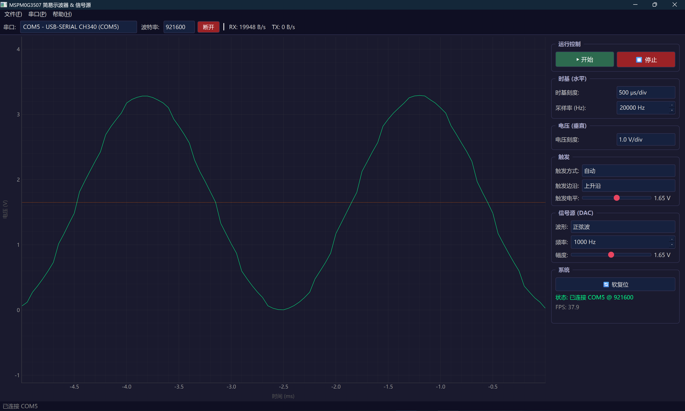
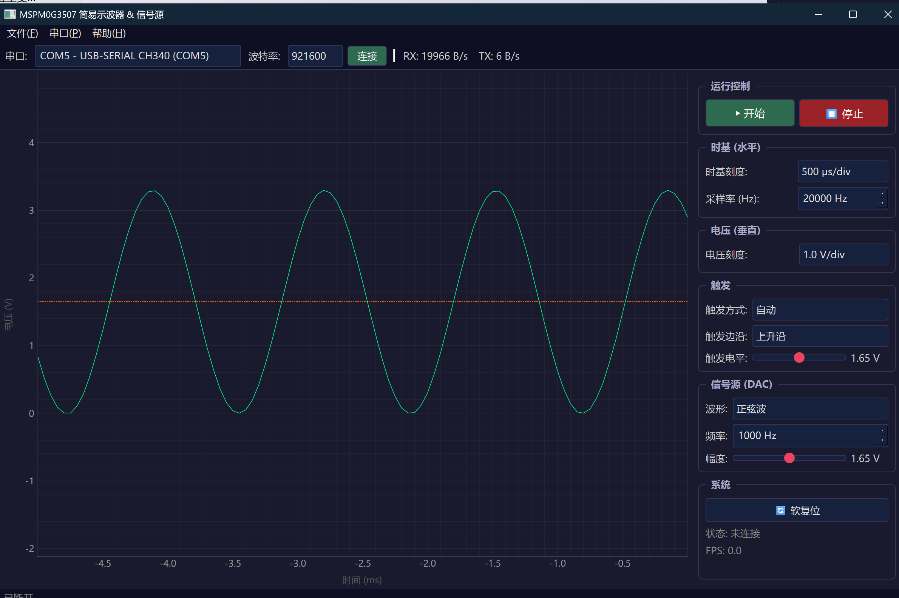

# MSPM0G3507 简易示波器 & 信号源

基于 **LCKFB 地猛星 MSPM0G3507** (Cortex-M0+, LQFP-48) 开发板的 USB 虚拟示波器项目。MCU 通过 ADC 采集模拟信号，经 USB 串口上传至 PC 上位机实时显示波形；同时内置 DAC 信号发生器，可输出正弦波作为自测信号源。

## 项目结构

```
├── firmware/               # MCU 固件 (CCS Theia 工程)
│   ├── dac_test.syscfg     # SysConfig 外设配置
│   ├── dac_test.c          # 主程序
│   └── targetConfigs/      # 调试器配置
├── upper_computer/         # 上位机软件 (Python + PyQt6)
├── simulator/              # MCU 协议模拟器
├── 1.png                   # 内置信号源测试截图
├── 2.png                   # 外部信号源测试截图
└── README.md
```

## 功能特性

### MCU 固件
- **ADC 采样**：轮询模式，~13 ksps，256 点/帧，12-bit 分辨率
- **DAC 信号源**：DMA 循环输出正弦波 (250Hz, 64 点表)
- **UART 通信**：921600 bps，自定义二进制帧协议
- **CRC-16-CCITT** 校验 + 字节填充抗干扰
- **LED 指示**：PA0 运行状态灯

### 上位机软件
- 实时波形显示，深色主题 UI
- 时基刻度 (1μs ~ 1s/div)、电压刻度可调
- 触发方式：自动 / 正常 / 单次，触发电平可设
- 波形数据 CSV 导出
- 串口速率实时显示

### 模拟器
- 完整协议兼容，可脱离硬件调试上位机
- 支持虚拟串口对 (com0com) 联调

## 硬件连接

| 引脚 | 功能 | 备注 |
|------|------|------|
| PA27 | ADC 输入 (ch0) | 接被测信号 |
| PA15 | DAC 输出 | 信号源自测时用杜邦线连至 PA27 |
| PA10 | UART0 TX | CH340 USB 串口 |
| PA11 | UART0 RX | CH340 USB 串口 |
| PA0 | LED | 运行指示 |

## 开发环境

| 组件 | 版本 |
|------|------|
| IDE | CCS Theia 20.4.0 |
| SDK | MSPM0 SDK 2.10.00.04 |
| SysConfig | 1.26.2 |
| 编译器 | TI Arm Clang 4.0.4 LTS |
| 调试器 | J-Link / XDS-110 |
| 上位机 | Python 3.10+, PyQt6, pyqtgraph |

## 使用方法

### 1. 烧录固件

1. CCS Theia → Import CCS Project → 选择 `firmware/` 目录
2. 打开 `dac_test.syscfg`，SysConfig 自动生成外设配置
3. Build → Debug 烧录至开发板
4. 用杜邦线连接 **PA15 ↔ PA27**（自测信号源模式）

### 2. 启动上位机

```bash
pip install -r upper_computer/requirements.txt
python upper_computer/main.py
```

工具栏选择对应 COM 口，波特率 **921600**，点击连接即可看到实时波形。

### 3. 使用模拟器（无硬件调试）

```bash
# 安装 com0com 虚拟串口工具，创建 COM10↔COM11 串口对
python simulator/simulator.py --port COM10 --baud 921600

# 上位机连接 COM11
python upper_computer/main.py
```

## 通信协议

自定义二进制帧，CRC-16-CCITT 校验：

```
Frame: [SYNC 1B] [CMD 1B] [LEN 2B LE] [PAYLOAD LEN bytes] [CRC16 2B LE]
PC → MCU: SYNC = 0x55
MCU → PC: SYNC = 0xAA
```

Payload 中的 0xAA、0xAB、0x55 使用转义字节 0xAB 编码，避免帧同步误判。

### MCU → PC 数据帧

| 偏移 | 大小 | 字段 |
|------|------|------|
| 0 | 1 | SYNC = 0xAA |
| 1 | 1 | CMD = 0x01 (DATA) |
| 2 | 2 | 负载长度 LE |
| 4 | 2 | 帧序号 LE |
| 6 | 2 | 采样点数 N LE |
| 8 | N×2 | 采样数据 (uint16 LE) |
| 8+N×2 | 2 | CRC-16-CCITT LE |

## 测试结果

### 内置信号源测试

DAC 输出 250Hz 正弦波 → PA27 ADC 采集 → 上位机显示：



### 外部信号发生器测试

外部信号发生器输入 100Hz 方波 → PA27 ADC 采集 → 上位机显示：



## 版本

v1.0 — 2026 年 6 月
